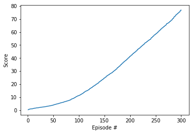

## Methodology

This work implements the DDPG algorithm (Deep Deterministic Policy Gradients) to the 20 agents Reacher environment, as described in [_Continuous Control with Deep Reinforcement Learning_][ddpg-paper] (Lillicrap et al). The foundation of this code-base is from the [Udacity DRL `ddpg-bipedal` notebook][ddpg-repo]

[ddpg-paper]: https://arxiv.org/pdf/1509.02971.pdf
[ddpg-repo]: https://github.com/udacity/deep-reinforcement-learning/blob/master/ddpg-bipedal/DDPG.ipynb

## Implementation 

The network comprises of 2 networks:

- Actor: 256 -> 256
- Critic: 256 -> 256 -> 128

Hyperparameters:

- replay buffer size = 1e6
- minibatch size = 64
- discount factor = 0.99
- tau for soft update of target parameters = 1e-3
- learning rate of the actor = 1e-4
- learning rate of the critic = 3e-4
- L2 weight decay = 0.0001

## Results 

The agents were able to solve task in 216 episodes with a final average score of 58.76 after 300 episodes.

## Enhancements

- Improving results tunning the networks scructures (adding layers or units per layers, ...)
- Implement PPO, D3PG or D4PG that probably  would produce better results

